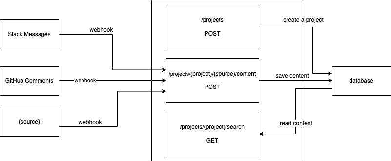

# Ebla Project

<!-- toc -->

- [What is Ebla?](#what-is-ebla)
- [Ebla of today.](#ebla-of-today)
- [Diagram](#diagram)
- [Developement](#developement)
- [License](#license)

<!-- tocstop -->

## What is Ebla?

Ebla is one of the most extensive archaeological sites from the Bronze Age in western Syria. Excavations in Elba unearthed one of the biggest and the oldest archives ever found from the third millennium BC.

If you wish to read more about Ebla click [here](https://en.unesco.org/syrian-observatory/news/ebla-tell-mardikh).

## Ebla of today.

Our project is focused to inject automation into archivisation. No more worries that some of your historical conversations will vanish. With Ebla Project your archive will update automatically.
Initially we will focus on Slack but after that, who knows, GitHub, Twitter... World is our oyster.

## Diagram

*  You will be able to connect many sources.

*  You will be able to register many projects. 

*  Messages will be stored based on the project membership.

## Developement

You will need to install docker-compose. It is a tool for defining and running multi-container Docker applications.
You can find instructions on how to install it [here](https://docs.docker.com/compose/install/).   
After successful installation, run this command: `docker-compose -f docker-compose.yml up`.
This will start whole enviroment required to run ebla.    
Now, go to `http://localhost:enter your port/` to check if everything works correctly.

## License

[MIT](./LICENSE)
